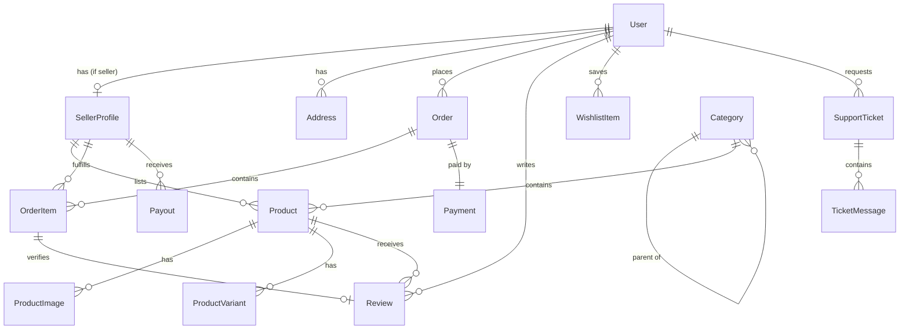

# Data Model

## Master Data vs. Transactional Data

- **Master data** — relatively stable reference/core entities that other things point to.
  Changes rarely, usually via an admin flow. Examples: users, products, categories, accounts,
  price lists, org units.
- **Transactional data** — records of things that happened, usually time-stamped and
  append-heavy, referencing master data by ID. Examples: orders, payments, bookings, audit logs,
  sessions.

## Entities

### User — Master

- **Purpose:** Base account for every human actor in the system (buyer, seller, admin, support).
  Role-specific data lives in a linked `SellerProfile` for sellers; admin/support have no extra
  profile table beyond a `role` flag.
- **Key fields:** id, email (unique), password_hash (nullable if Google-only), google_id
  (nullable), name, phone, role (enum: buyer, seller, admin, support), mfa_enabled (bool),
  mfa_secret (nullable, encrypted), status (active, suspended), email_verified_at, created_at,
  updated_at
- **Relationships:** has one `SellerProfile` (if role=seller); has many `Address`; has many
  `Order` (as buyer); has many `CartItem`; has many `Review`; has many `WishlistItem`; has many
  `SupportTicket` (as requester or as assigned agent, if support)
- **Lifecycle:** Created via self-registration (buyer/seller) or created by an Admin (support
  agent accounts). Never hard-deleted — deactivate via `status = suspended` to preserve order/
  review history integrity. Role changes (e.g. buyer becoming a seller) are additive, not
  destructive.
- **Constraints / invariants:** email unique across all roles; mfa_secret required if
  mfa_enabled=true and role in (admin, support); password_hash required unless google_id is set.

---

### SellerProfile — Master

- **Purpose:** Business/legal details and payout configuration for a User acting as a seller.
- **Key fields:** id, user_id (FK, unique), company_name, registration_number (CUI), iban,
  stripe_connect_account_id, commission_rate_override (nullable, falls back to platform default),
  status (enum: pending, approved, suspended, rejected), approved_by_admin_id (nullable),
  approved_at (nullable), created_at, updated_at
- **Relationships:** belongs to `User` (one-to-one); has many `Product`; has many `OrderItem`
  (as fulfilling seller); has many `Payout`
- **Lifecycle:** Created when a User completes seller registration (status=pending). Transitions
  to approved/rejected/suspended only by a Platform Admin action, which must be recorded in
  `AuditLog`. Not deletable — suspend instead, to preserve historical order/payout records.
- **Constraints / invariants:** one SellerProfile per User; cannot list products while status !=
  approved; cannot receive payouts without a verified stripe_connect_account_id.

---

### Category — Master

- **Purpose:** Hierarchical taxonomy products are organized under, drives browse/nav and filters.
- **Key fields:** id, name, slug (unique), parent_id (nullable, self-referencing), image_url,
  is_active, sort_order, created_at, updated_at
- **Relationships:** self-referential tree (parent/children); has many `Product`
- **Lifecycle:** Created/edited/archived only by Platform Admin. Archiving (is_active=false) hides
  it from browse/search without deleting products already assigned to it.
- **Constraints / invariants:** slug unique; a category cannot be its own ancestor (no cycles).

---

### Product — Master

- **Purpose:** A sellable listing owned by one seller.
- **Key fields:** id, seller_id (FK), category_id (FK), title, slug, description, base_price
  (decimal), currency (default RON), stock_quantity, sku, is_active, avg_rating (denormalized,
  recomputed from Review), review_count (denormalized), created_at, updated_at
- **Relationships:** belongs to `SellerProfile`; belongs to `Category`; has many `ProductImage`;
  has many `ProductVariant` (optional, e.g. size/color); has many `Review`; has many `CartItem`;
  has many `OrderItem`; has many `WishlistItem`
- **Lifecycle:** Created/edited by the owning Seller only while their SellerProfile is approved.
  Soft-delete only (`is_active=false`) — never hard-deleted, since past orders reference it by
  snapshot (see OrderItem) but the catalog entry itself must stay auditable.
- **Constraints / invariants:** base_price > 0; stock_quantity >= 0; a Product always belongs to
  exactly one seller (no shared listings); cannot be set is_active=true if the owning seller is
  not approved.

---

### ProductVariant — Master

- **Purpose:** Optional purchasable variation of a Product (e.g. size/color) with its own price
  delta and stock.
- **Key fields:** id, product_id (FK), name (e.g. "Red / L"), sku, price_delta (decimal, added to
  base_price), stock_quantity, created_at, updated_at
- **Relationships:** belongs to `Product`; has many `CartItem`/`OrderItem` (referenced when a
  variant is chosen)
- **Lifecycle:** Created/edited by the owning seller alongside the parent Product. Soft-delete via
  an `is_active` style flag if needed (or deactivate the parent Product).
- **Constraints / invariants:** stock_quantity >= 0; sku unique within a product.

---

### ProductImage — Master

- **Purpose:** Image assets for a product listing.
- **Key fields:** id, product_id (FK), url, sort_order, alt_text, created_at
- **Relationships:** belongs to `Product`
- **Lifecycle:** Managed by the owning seller as part of product edits. Hard-delete is fine (no
  historical significance beyond what's already been ordered — order snapshots store their own
  image reference, see OrderItem).
- **Constraints / invariants:** a Product should have at least one image before `is_active=true`.

---

### Address — Master

- **Purpose:** A buyer's saved shipping/billing address.
- **Key fields:** id, user_id (FK), label (e.g. "Home"), full_name, phone, street, city, county,
  postal_code, country (default Romania), is_default, created_at, updated_at
- **Relationships:** belongs to `User`; referenced by `Order` (shipping_address snapshot)
- **Lifecycle:** Full CRUD by the owning buyer. Deleting an address does not affect past orders,
  since Order stores a point-in-time snapshot, not a live FK reference.
- **Constraints / invariants:** exactly one address per user may have is_default=true.

---

### Cart / CartItem — Transactional (working state)

- **Purpose:** A buyer's in-progress selection before checkout. Effectively transactional
  (ephemeral, per-user, high write frequency) even though it's not a "record of something that
  happened" yet.
- **Key fields (CartItem):** id, user_id (FK), product_id (FK), variant_id (nullable FK),
  quantity, added_at
- **Relationships:** belongs to `User`; belongs to `Product` (and optionally `ProductVariant`)
- **Lifecycle:** Created when a buyer adds an item; updated in place (quantity changes); deleted
  on removal or after successful checkout (converted into `OrderItem` snapshots). No audit trail
  needed — not a financial record.
- **Constraints / invariants:** quantity > 0; unique per (user_id, product_id, variant_id).

---

### Order — Transactional

- **Purpose:** A buyer's checkout event, may span multiple sellers. The top-level financial/
  logistic record; splits into per-seller `OrderItem`s for fulfillment.
- **Key fields:** id, buyer_id (FK), status (enum: pending_payment, paid, partially_shipped,
  shipped, delivered, cancelled, refunded), subtotal, platform_fee_total, shipping_total, total,
  currency, shipping_address_snapshot (JSON), billing_address_snapshot (JSON), stripe_payment_
  intent_id, placed_at, created_at, updated_at
- **Relationships:** belongs to `User` (buyer); has many `OrderItem`; has one `Payment`
- **Lifecycle:** Created at checkout from the buyer's Cart (immutable snapshot at that moment).
  Never edited by a buyer after placement — status transitions happen via Payment webhook events
  and Seller/Support fulfillment actions, all logged. Never deleted; cancellations/refunds are
  status transitions with an audit trail, not deletions.
- **Constraints / invariants:** total = subtotal + shipping_total (platform_fee_total is informational,
  deducted from seller payouts, not added to buyer total); status transitions are one-directional
  (no reverting `delivered` back to `pending_payment`).

---

### OrderItem — Transactional

- **Purpose:** One seller's line item(s) within an Order — the unit a Seller sees and fulfills.
  Stores a point-in-time snapshot of product data so later edits/deletion of the Product don't
  alter historical orders.
- **Key fields:** id, order_id (FK), seller_id (FK), product_id (FK, for reference only),
  product_title_snapshot, product_image_url_snapshot, unit_price_snapshot, quantity,
  commission_rate_snapshot, fulfillment_status (enum: awaiting_fulfillment, shipped, delivered,
  cancelled, returned), tracking_number (nullable), shipped_at (nullable), delivered_at (nullable)
- **Relationships:** belongs to `Order`; belongs to `SellerProfile`; references `Product`
  (informational, not authoritative after snapshot)
- **Lifecycle:** Created atomically with the parent Order at checkout. `fulfillment_status`
  updated only by the owning Seller (or Support, for disputes/refunds) — never by the buyer
  directly. Never deleted.
- **Constraints / invariants:** quantity <= the stock available at time of order (checked at
  checkout, not enforced retroactively); a Seller may only update OrderItems where
  seller_id = their own SellerProfile.id.

---

### Payment — Transactional

- **Purpose:** Record of the Stripe payment for an Order (one order = one payment in v1; no
  partial/split payments).
- **Key fields:** id, order_id (FK, unique), stripe_payment_intent_id, amount, currency, status
  (enum: requires_payment, succeeded, failed, refunded, partially_refunded), refunded_amount,
  created_at, updated_at
- **Relationships:** belongs to `Order`
- **Lifecycle:** Created when checkout initiates a Stripe PaymentIntent; updated via Stripe
  webhook events (source of truth is Stripe, this table mirrors it for querying). Refunds create
  an update here plus an `AuditLog` entry (and possibly a `Payout` adjustment).
- **Constraints / invariants:** never store raw card data — only Stripe references; amount must
  match the parent Order's total at time of creation.

---

### Payout — Transactional

- **Purpose:** Record of a payment sent from the platform to a Seller (via Stripe Connect) for
  settled OrderItems, net of commission.
- **Key fields:** id, seller_id (FK), period_start, period_end, gross_amount, commission_amount,
  net_amount, stripe_transfer_id, status (enum: pending, paid, failed), created_at, paid_at
- **Relationships:** belongs to `SellerProfile`
- **Lifecycle:** Created by a scheduled/background payout job (not user-initiated). Never edited
  after status=paid except by an Admin-approved correction, logged in `AuditLog`.
- **Constraints / invariants:** net_amount = gross_amount - commission_amount; only OrderItems
  with fulfillment_status=delivered (past any return window) are eligible for payout.

---

### Review — Transactional

- **Purpose:** A buyer's rating/comment on a product they purchased.
- **Key fields:** id, product_id (FK), user_id (FK), order_item_id (FK, proves verified purchase),
  rating (1-5), comment, seller_response (nullable), status (enum: visible, flagged, removed),
  created_at, updated_at
- **Relationships:** belongs to `Product`; belongs to `User`; belongs to `OrderItem` (verification
  link)
- **Lifecycle:** Created by the buyer once the linked OrderItem is delivered. Buyer may edit their
  own review; Seller may add/edit `seller_response` only, not the review itself. Admin can set
  status=removed (moderation) — soft-delete, audit-logged.
- **Constraints / invariants:** one Review per (user_id, order_item_id); rating between 1 and 5;
  Product.avg_rating/review_count recomputed whenever a Review's status changes.

---

### WishlistItem — Transactional (working state)

- **Purpose:** A buyer's saved-for-later products.
- **Key fields:** id, user_id (FK), product_id (FK), added_at
- **Relationships:** belongs to `User`; belongs to `Product`
- **Lifecycle:** Created/deleted freely by the buyer. No audit trail needed.
- **Constraints / invariants:** unique per (user_id, product_id).

---

### SupportTicket — Transactional

- **Purpose:** A buyer or seller support request, worked by a Support agent.
- **Key fields:** id, requester_id (FK, User), related_order_id (nullable FK), assigned_agent_id
  (nullable FK, User with role=support), subject, category (enum: order_issue, payout_issue,
  product_dispute, account, other), status (enum: open, in_progress, escalated, resolved,
  closed), priority, created_at, updated_at, closed_at
- **Relationships:** belongs to `User` (requester); optionally belongs to `Order`; optionally
  assigned to a `User` (support role); has many `TicketMessage`
- **Lifecycle:** Created by buyer/seller or on their behalf by Support. Status progressed by the
  assigned agent; escalation reassigns/flags for Admin. Closed tickets are retained, not deleted
  (support history).
- **Constraints / invariants:** assigned_agent_id, if set, must reference a User with role=support
  or admin.

---

### TicketMessage — Transactional

- **Purpose:** Individual message in a SupportTicket thread.
- **Key fields:** id, ticket_id (FK), sender_id (FK, User), body, created_at
- **Relationships:** belongs to `SupportTicket`; belongs to `User` (sender)
- **Lifecycle:** Append-only; never edited or deleted after posting.
- **Constraints / invariants:** sender must be the ticket's requester, its assigned agent, or an
  Admin.

---

### AuditLog — Transactional

- **Purpose:** Immutable record of sensitive/privileged actions for accountability and dispute
  resolution.
- **Key fields:** id, actor_id (FK, User), actor_role, action (e.g. seller_approved,
  commission_rate_changed, manual_refund_issued, product_removed, ticket_escalated), target_type,
  target_id, metadata (JSON, before/after values where relevant), created_at
- **Relationships:** belongs to `User` (actor); polymorphic reference to the affected entity
  (target_type/target_id)
- **Lifecycle:** Append-only, created automatically by the service layer whenever a privileged
  action executes (seller approval/suspension, commission changes, manual refunds beyond an
  agent's limit, listing removal, moderation actions). Never edited or deleted.
- **Constraints / invariants:** write-once; no update/delete API exists for this table at all.

---

## Relationships Overview

## Data Retention / Archival

- `AuditLog`, `Order`, `OrderItem`, `Payment`, `Payout`: retained indefinitely (financial/legal
  records) — no purge job planned for v1.
- `Cart`/`CartItem`: abandoned carts (no activity for 30 days) may be purged by a background job;
  not a compliance requirement, just housekeeping.
- GDPR "right to erasure" requests: anonymize (not hard-delete) the `User` record — replace PII
  fields with placeholders — while preserving `Order`/`Review`/`AuditLog` rows that reference the
  user_id, since those are needed for financial/legal retention. Exact anonymization workflow is a
  TODO to design when GDPR request handling is built (see [security.md](security.md)).
- `SupportTicket`/`TicketMessage`: retained indefinitely for now; revisit a retention window later
  if storage becomes a concern.
